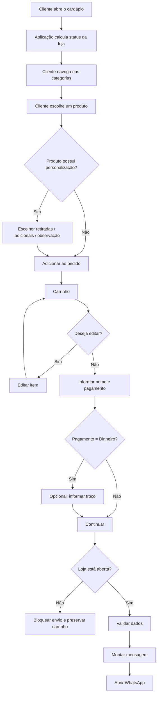
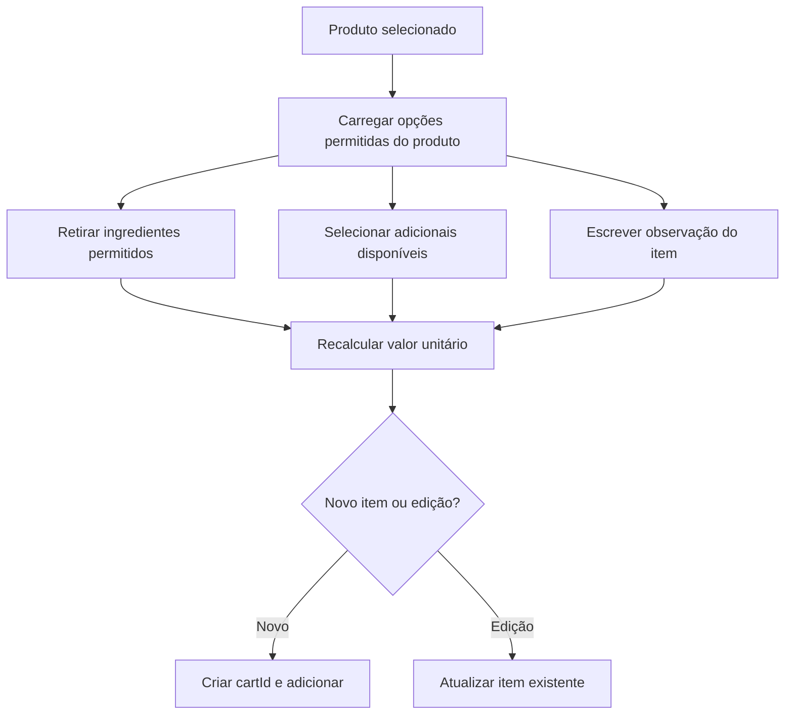
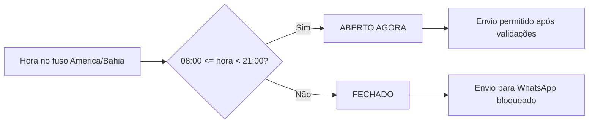
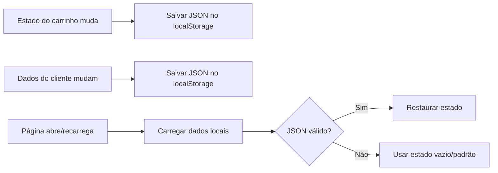

# Fluxo da Aplicação — Cactus Burguer

## 1. Jornada principal

## 2. Fluxo de personalização

## 3. Fluxo do status de funcionamento

O status é recalculado periodicamente e novamente no momento do envio, para evitar usar um estado antigo da tela.

## 4. Fluxo de persistência

## 5. Fluxos de validação/erro

### Loja fechada
- mostrar mensagem de horário;
- não abrir WhatsApp;
- não apagar carrinho.

### Nome vazio
- pedir nome antes do envio;
- manter carrinho e demais campos.

### Carrinho vazio
- impedir envio;
- orientar a adicionar ao menos um item.

### Troco inválido
- quando preenchido, deve ser valor numérico positivo;
- informar erro sem apagar o pedido.

### Dados locais corrompidos
- ignorar JSON inválido;
- iniciar com estado seguro em vez de quebrar a aplicação.

## 6. Navegação mobile

- categorias permanecem acessíveis horizontalmente;
- botão **Meu pedido** fica fixo;
- botão **Voltar ao topo** aparece após rolagem suficiente;
- modais e drawer devem ocupar largura confortável sem gerar overflow horizontal.
